# 🎓 Smart Classroom — IoT + Vision AI

> **An AI-powered smart classroom management system** that integrates computer vision, face recognition, IoT automation, and real-time analytics into a unified platform — enabling automated attendance, live engagement monitoring, and intelligent device control.

---

## 📋 Table of Contents

1. [Problem Statement](#-problem-statement)
2. [Business Objective](#-business-objective)
3. [Feature Overview](#-feature-overview)
4. [Technology Stack](#-technology-stack)
5. [High-Level Architecture](#-high-level-architecture)
6. [System Communication: How Everything Connects](#-system-communication-how-everything-connects)
7. [Data Flow Diagrams](#-data-flow-diagrams)
8. [Project Structure](#-project-structure)
9. [Database Architecture](#-database-architecture)
10. [Backend Architecture & API Reference](#-backend-architecture--api-reference)
11. [Frontend Architecture](#-frontend-architecture)
12. [Environment Variables & Configuration](#-environment-variables--configuration)
13. [Setup Guide](#-setup-guide)
14. [Running the Project](#-running-the-project)
15. [WebSocket Events Reference](#-websocket-events-reference)
16. [Key File Documentation](#-key-file-documentation)
17. [Troubleshooting Guide](#-troubleshooting-guide)

---

## 🔴 Problem Statement

Traditional classrooms rely on **manual roll calls** and subjective teacher observations to manage attendance and student engagement. This process is:

- **Time-consuming** — Roll call can consume 5–10 minutes per session
- **Error-prone** — Proxy attendance is common
- **Non-analytical** — No quantitative data on student engagement
- **Manually operated** — Lights/fans left on even when classrooms are empty

---

## 🎯 Business Objective

Build a **production-grade smart classroom system** that:

| Goal | Solution |
|------|---------|
| Automate attendance | Face recognition on live camera feed |
| Track engagement | Head pose + phone detection + visibility scoring |
| Reduce energy waste | Occupancy-triggered IoT device automation |
| Provide insights | Per-session analytics stored in MongoDB |
| Enable remote control | Web UI dashboard accessible from any device |

---

## ✅ Feature Overview

| Feature | Description |
|---------|-------------|
| 🎯 **Face Registration** | Single-pose or 5-pose multi-angle registration via browser webcam |
| 👁️ **Live Face Recognition** | Real-time InsightFace ArcFace recognition on Pi camera stream |
| 📋 **Session Attendance** | Present / Late / Absent classification with configurable windows |
| 📊 **Attention Analytics** | Composite score from head pose, face visibility, and phone usage |
| 📱 **Phone Detection** | YOLOv8 cell phone detection with student attribution |
| 💡 **IoT Automation** | ESP32-controlled lights and fans with AUTO/MANUAL modes |
| 📡 **Real-time Updates** | WebSocket push for recognition, occupancy, alerts |
| 📈 **Session History** | Full past-session drill-down with attendance + analytics |
| 📤 **CSV Export** | One-click attendance export per session |
| 🔐 **Faculty Override** | Manual attendance status correction from the dashboard |

---

## 🛠️ Technology Stack

### Backend

| Layer | Technology | Purpose |
|-------|-----------|---------|
| Web Framework | **FastAPI** (Python 3.10+) | REST API + WebSocket server |
| AI Vision | **YOLOv8n** (Ultralytics) | Person + phone detection + tracking |
| Face AI | **InsightFace** (ArcFace) | Face embedding + recognition |
| Database | **MongoDB** (via PyMongo) | Persistent storage for all data |
| Camera | **OpenCV** + MJPEG stream | Reads Raspberry Pi camera stream |
| IoT Bridge | **HTTP requests** to ESP32 | Light and fan control commands |
| Concurrency | **Python threading** + asyncio | Background detection + WS events |

### Frontend

| Layer | Technology | Purpose |
|-------|-----------|---------|
| Framework | **React 19** + Vite | SPA web application |
| Routing | **React Router v7** | Client-side page navigation |
| HTTP Client | **Axios** | REST API calls to FastAPI |
| Real-time | **WebSocket API** | Live event subscriptions |
| Charts | **Recharts** | Attention analytics bar charts |
| Icons | **Lucide React** | UI icon set |
| Styling | **TailwindCSS** + Custom CSS | Dark-mode glassmorphism UI |

### Hardware

| Device | Role |
|--------|------|
| **Raspberry Pi** | Runs MJPEG camera server at port 5000 |
| **IP Camera / Pi Camera** | Classroom video feed source |
| **ESP32 Microcontroller** | Controls classroom lights and fans via HTTP endpoints |

---

## 🏗️ High-Level Architecture

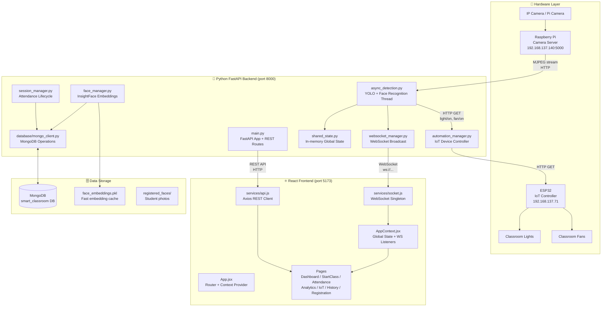

---

## 📡 System Communication: How Everything Connects

### 1. Camera → Backend Pipeline

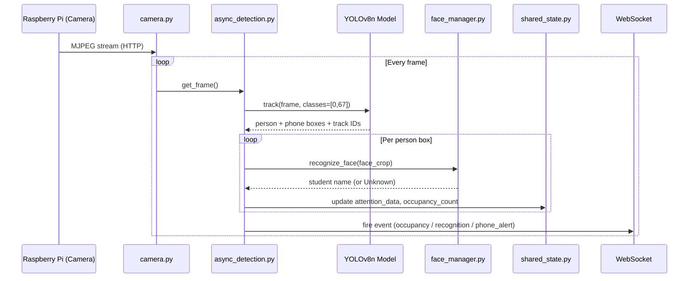

### 2. Backend → ESP32 (IoT Control)

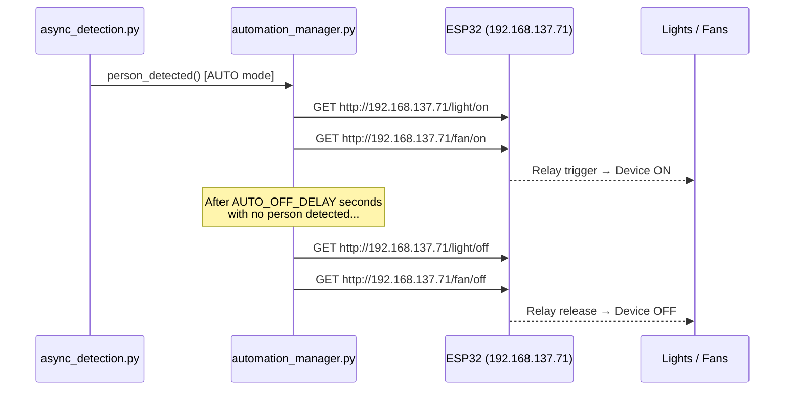

### 3. Frontend → Backend (REST + WebSocket)

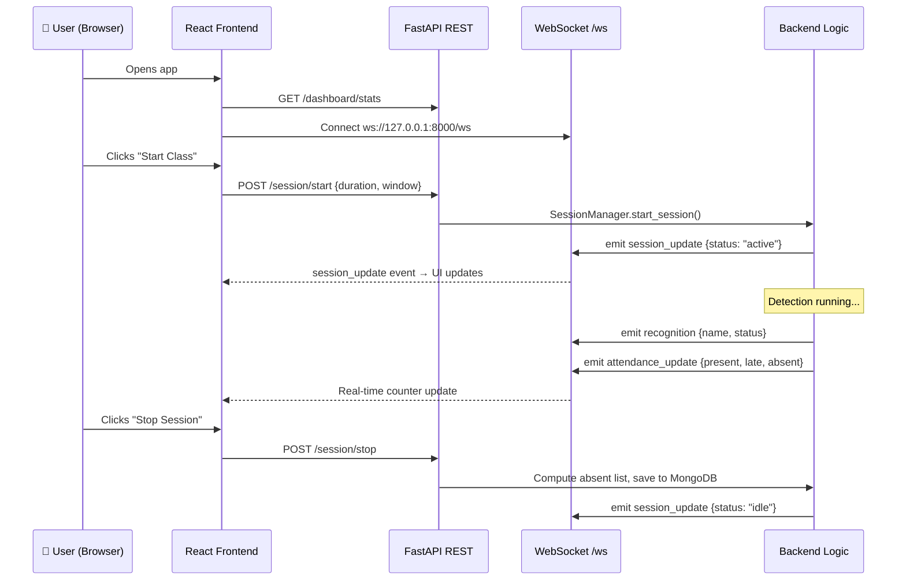

---

## 🔄 Data Flow Diagrams

### Complete System Data Flow

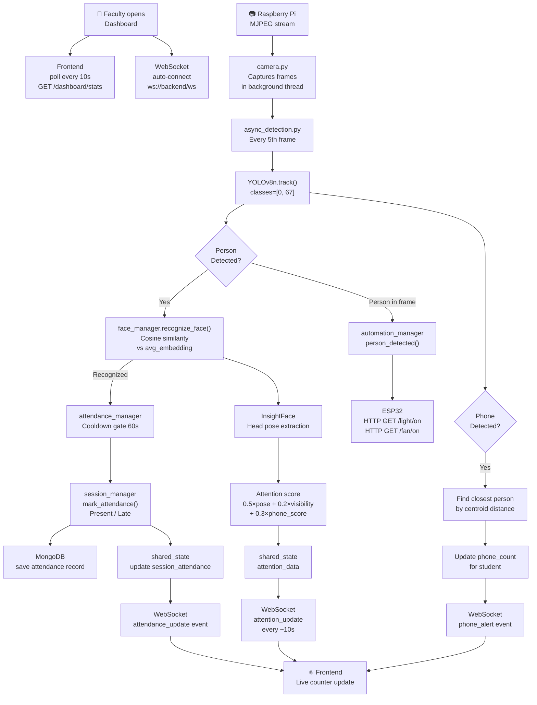

### Student Registration Flow

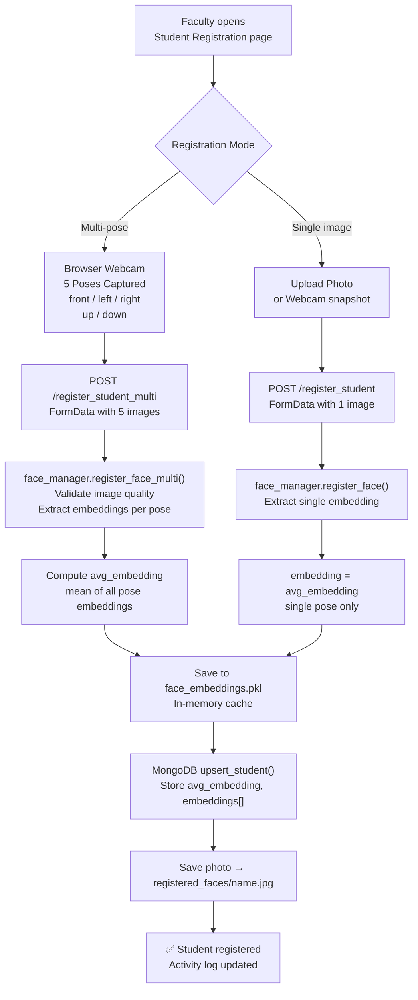

### Attendance Classification Flow

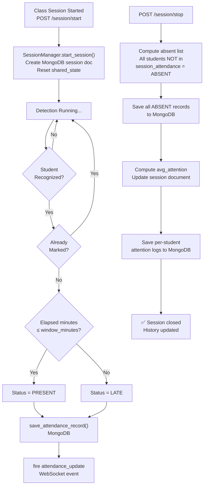

---

## 📁 Project Structure

```
smart-classroom-IOT+VisionAI/
│
├── README.md                          ← You are here
├── .gitignore
├── implementation_plan.md             ← Internal dev notes
│
├── backend/                           ← Python FastAPI server
│   ├── main.py                        ← App entry point + all REST routes
│   ├── config.py                      ← Hardware IPs + env-configurable settings
│   ├── shared_state.py                ← Global in-memory state (thread-safe)
│   │
│   ├── async_detection.py             ← Background detection thread (YOLO + Face)
│   ├── face_manager.py                ← InsightFace registration + recognition
│   ├── camera.py                      ← Raspberry Pi MJPEG stream reader
│   ├── attendance_manager.py          ← Cooldown gate + MongoDB query helpers
│   ├── session_manager.py             ← Session lifecycle + attendance classification
│   ├── automation_manager.py          ← ESP32 IoT device control
│   ├── websocket_manager.py           ← WebSocket connection pool
│   ├── event_manager.py               ← WebSocket event broadcaster
│   │
│   ├── database/
│   │   ├── database.py                ← Database module init
│   │   └── mongo_client.py            ← MongoDB CRUD wrapper (MongoDBClient)
│   │
│   ├── utils/
│   │   ├── __init__.py
│   │   └── device.py                  ← GPU/CPU auto-detection utility
│   │
│   ├── registered_faces/              ← Student profile photos (created at runtime)
│   ├── face_embeddings.pkl            ← Fast-load embedding cache
│   ├── yolov8n.pt                     ← YOLOv8 nano model weights
│   ├── attendance.csv                 ← Legacy CSV (no longer written during operation)
│   ├── requirements-lock.txt          ← Pinned Python dependencies
│   └── venv/                          ← Python virtual environment (not committed)
│
└── frontend/                          ← React + Vite web application
    ├── index.html                     ← HTML entry point
    ├── package.json                   ← npm dependencies
    ├── vite.config.js                 ← Vite dev server config
    ├── tailwind.config.js             ← Tailwind CSS config
    ├── postcss.config.js              ← PostCSS config
    ├── .env                           ← API/WS URLs (VITE_API_URL, VITE_WS_URL)
    │
    └── src/
        ├── main.jsx                   ← React DOM mount
        ├── App.jsx                    ← Root component: router + layout + routes
        ├── App.css                    ← App-level styles
        ├── index.css                  ← Global design system tokens + utilities
        │
        ├── pages/                     ← Full-page view components
        │   ├── Dashboard.jsx          ← Overview: stats, quick actions, IoT status
        │   ├── StartClass.jsx         ← Session config, timer, live counters
        │   ├── StudentRegistration.jsx← Multi-pose face registration
        │   ├── Attendance.jsx         ← Live attendance table + manual override
        │   ├── AttentionAnalytics.jsx ← Charts, phone alerts, per-student breakdown
        │   ├── IoTControl.jsx         ← Device control + automation mode
        │   ├── History.jsx            ← Past sessions list + drill-down detail
        │   ├── Registration.jsx       ← Simple registration wrapper
        │   └── Settings.jsx           ← Settings placeholder
        │
        ├── components/                ← Reusable UI components
        │   ├── Sidebar.jsx            ← Navigation sidebar
        │   ├── PageHeader.jsx         ← Page title + subtitle bar
        │   ├── StatCard.jsx           ← Metric display card
        │   ├── StatusBadge.jsx        ← Colored status pill
        │   ├── AttendanceChart.jsx    ← Attendance bar chart
        │   ├── CameraPanel.jsx        ← Live video feed panel
        │   ├── RecognitionFeed.jsx    ← Recognition event stream
        │   ├── Navbar.jsx             ← Top navigation bar
        │   └── ThemeToggle.jsx        ← Light/dark mode toggle
        │
        ├── context/
        │   ├── AppContext.jsx         ← Global app state + WS event handlers
        │   └── ThemeContext.jsx       ← Dark/light theme provider
        │
        ├── hooks/
        │   └── useWebSocket.js        ← Custom hook for WS event subscriptions
        │
        ├── services/
        │   ├── api.js                 ← Axios-based REST API client
        │   └── socket.js              ← Singleton WebSocket service
        │
        ├── routes/
        │   └── AppRoutes.jsx          ← Alternative route definitions (unused in prod)
        │
        ├── layouts/
        │   └── MainLayout.jsx         ← Layout wrapper (sidebar + content)
        │
        └── assets/                    ← Static assets
```

---

## 🗄️ Database Architecture

### MongoDB Database: `smart_classroom`

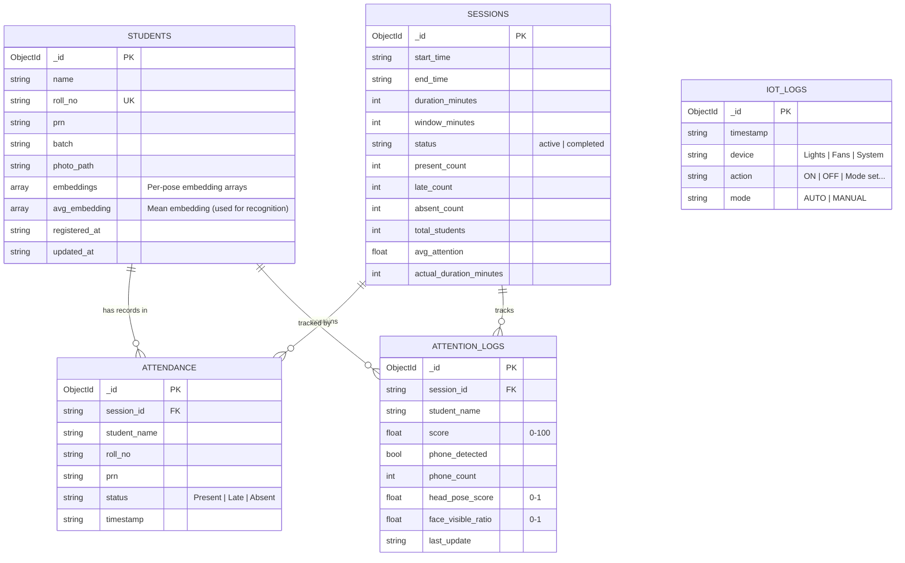

### Embedding Storage Strategy

```
Face Registration
│
├── face_embeddings.pkl  (Fast-load cache)
│   └── {name: {embedding, avg_embedding, embeddings[], batch, roll_no, prn}}
│
└── MongoDB students collection
    └── avg_embedding[] stored as plain number array
        (loaded via _sync_from_mongo() on startup)

Recognition uses avg_embedding (mean of all poses) for cosine similarity.
Threshold: 0.45 default (configurable via FACE_RECOGNITION_THRESHOLD env var)
```

---

## 🐍 Backend Architecture & API Reference

### Module Dependency Graph

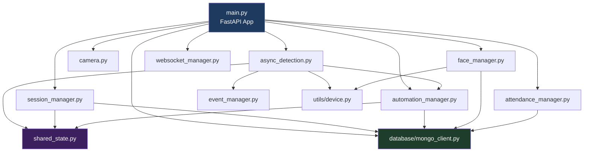

### REST API Endpoints

#### Dashboard
| Method | Route | Description |
|--------|-------|-------------|
| `GET` | `/` | Health check |
| `GET` | `/dashboard/stats` | All stats: students, session, IoT, alerts |
| `GET` | `/activity-log` | Recent 50 activity log entries |

#### Video Feed
| Method | Route | Description |
|--------|-------|-------------|
| `GET` | `/video_feed` | MJPEG stream with detection overlays |

#### Student Management
| Method | Route | Description |
|--------|-------|-------------|
| `GET` | `/students` | List all registered students (enriched from MongoDB) |
| `POST` | `/register_student` | Register student with single face image |
| `POST` | `/register_student_multi` | Register with up to 5 pose images |
| `PUT` | `/students/{name}` | Update student info + optional re-registration |
| `DELETE` | `/students/{name}` | Delete student (embedding + photo + MongoDB) |
| `GET` | `/students/{name}/photo` | Serve face photo |

#### Session Management
| Method | Route | Description |
|--------|-------|-------------|
| `POST` | `/session/start` | Start a new class session `{duration_minutes, window_minutes}` |
| `POST` | `/session/stop` | Stop current session + compute absent list |
| `GET` | `/session/status` | Live session state, elapsed/remaining time |
| `GET` | `/session/attendance` | All attendance records for current session |
| `GET` | `/session/history` | All past sessions (newest first) |
| `GET` | `/session/{session_id}` | Session detail + attendance + analytics |

#### Attendance
| Method | Route | Description |
|--------|-------|-------------|
| `GET` | `/attendance` | All attendance records from MongoDB |
| `GET` | `/attendance/session/{session_id}` | Attendance for specific session |
| `POST` | `/attendance/override` | Faculty manual override `{student_name, status}` |
| `GET` | `/attendance/export` | Download CSV of current session attendance |

#### Analytics
| Method | Route | Description |
|--------|-------|-------------|
| `GET` | `/analytics` | Basic occupancy + entry/exit logs |
| `GET` | `/analytics/attention` | Live attention scores per student |
| `GET` | `/analytics/session/{session_id}` | Past session attention analytics |
| `GET` | `/phone-alerts` | Recent phone detection events |

#### IoT Control
| Method | Route | Description |
|--------|-------|-------------|
| `GET` | `/iot/status` | Device states + mode + recent logs |
| `POST` | `/iot/light/{state}` | Control lights: `on` or `off` |
| `POST` | `/iot/fan/{state}` | Control fans: `on` or `off` |
| `POST` | `/iot/mode/{mode}` | Set mode: `AUTO` or `MANUAL` |

#### Legacy Automation (Preserved)
| Method | Route | Description |
|--------|-------|-------------|
| `POST` | `/automation/mode/{mode}` | Set automation mode |
| `POST` | `/automation/on` | Manual lights ON |
| `POST` | `/automation/off` | Manual lights OFF |

#### Config
| Method | Route | Description |
|--------|-------|-------------|
| `GET` | `/config/batches` | Batch/division options from env |

#### WebSocket
| Endpoint | Description |
|----------|-------------|
| `WS /ws` | Real-time event stream (bidirectional) |

---

## ⚛️ Frontend Architecture

### Routing Flow

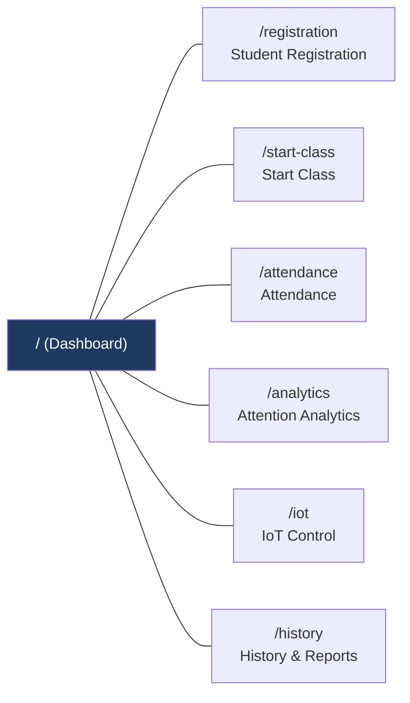

### Component Architecture

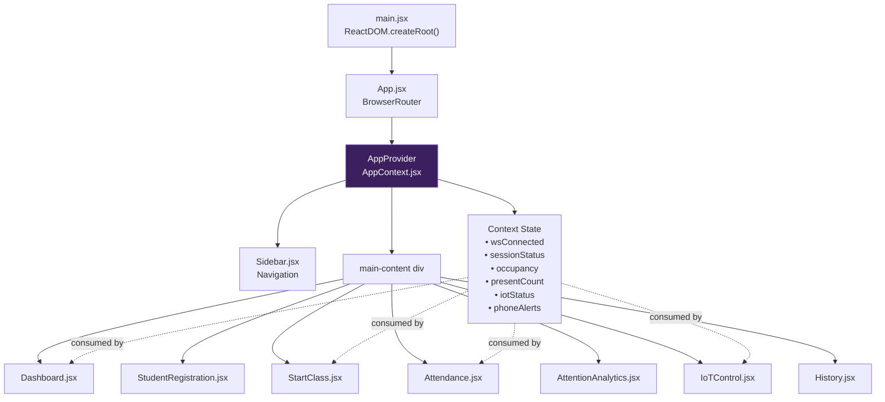

### State Management Strategy

`AppContext.jsx` is the **single source of truth** for all cross-page state. Pages consume it via the `useApp()` hook.

| State Variable | Updated By | Used By |
|---------------|-----------|---------|
| `sessionStatus` | WS `session_update` + poll | Dashboard, StartClass, Attendance |
| `occupancy` | WS `occupancy` event | Dashboard, StartClass |
| `presentCount` / `lateCount` / `absentCount` | WS `attendance_update` | Dashboard, StartClass |
| `iotStatus` | Dashboard stats poll | Dashboard, IoTControl |
| `phoneAlerts` | WS `phone_alert` | Dashboard, AttentionAnalytics |
| `avgAttention` | WS `attention_update` | Dashboard |
| `wsConnected` | SocketService onStatusChange | Sidebar status indicator |
| `serverOnline` | Dashboard stats poll success/fail | All pages |

### History Page Session State

The **History** page maintains its own local state (not in `AppContext`) because it is inherently session-specific and read-only:

```jsx
// History.jsx local state
const [sessions, setSessions] = useState([]);       // List of past sessions
const [detail, setDetail] = useState(null);          // Selected session detail view
```

When a user clicks a session row → `GET /session/{id}` → local `detail` state is set → component re-renders to show drill-down view.

### Real-Time Update Strategy

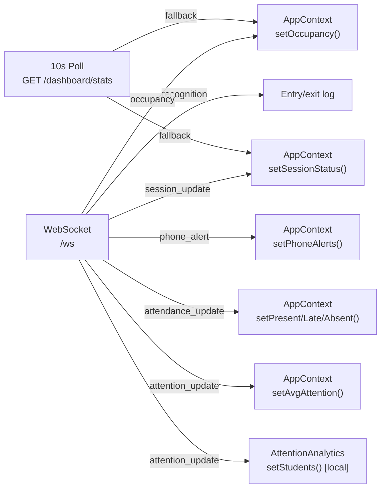

> **Design decision**: WebSocket events are the primary update mechanism. HTTP polling (`GET /dashboard/stats` every 10s) acts as a fallback/synchronization layer for clients that reconnect after a WebSocket outage.

---

## ⚙️ Environment Variables & Configuration

### Backend (`backend/.env` or system environment)

| Variable | Default | Description |
|----------|---------|-------------|
| `PI_STREAM_URL` | `http://192.168.137.140:5000/video_feed` | Raspberry Pi camera MJPEG stream URL |
| `ESP_IP` | `192.168.137.71` | ESP32 microcontroller IP address |
| `AUTO_OFF_DELAY` | `30` | Seconds of no-person before AUTO turns devices off |
| `CAMERA_FPS` | `30` | Target FPS for OpenCV camera capture |
| `MONGO_URI` | `mongodb://localhost:27017` | MongoDB connection string |
| `MONGO_DB` | `smart_classroom` | MongoDB database name |
| `BATCH_OPTIONS` | `1,2,3,A,B` | Comma-separated batch/division options |
| `FACE_RECOGNITION_THRESHOLD` | `0.45` | Cosine similarity threshold (0.30–0.70) |
| `ATTENTION_WEIGHT_POSE` | `0.50` | Weight of head pose in attention score |
| `ATTENTION_WEIGHT_VISIBILITY` | `0.20` | Weight of face visibility in attention score |
| `ATTENTION_WEIGHT_PHONE` | `0.30` | Weight of phone usage penalty in attention score |

> ⚠️ **Hardware Critical**: Do NOT change `PI_STREAM_URL` or `ESP_IP` unless the hardware network configuration changes.

### Frontend (`frontend/.env`)

| Variable | Default | Description |
|----------|---------|-------------|
| `VITE_API_URL` | `http://127.0.0.1:8000` | FastAPI backend REST base URL |
| `VITE_WS_URL` | `ws://127.0.0.1:8000/ws` | FastAPI WebSocket URL |

---

## 🚀 Setup Guide

### Prerequisites

| Requirement | Version |
|------------|---------|
| Python | 3.10+ |
| Node.js | 18+ |
| MongoDB | 6.0+ (local or Atlas) |
| Git | Any |
| CUDA (optional) | For GPU acceleration |

### 1. Clone the Repository

```bash
git clone <repository-url>
cd smart-classroom-IOT+VisionAI
```

### 2. Backend Setup

```bash
# Navigate to backend
cd backend

# Create virtual environment
python -m venv venv

# Activate (Windows)
venv\Scripts\activate

# Activate (Linux/macOS)
source venv/bin/activate

# Install dependencies
pip install -r requirements-lock.txt
```

**Key packages installed:**
- `fastapi`, `uvicorn[standard]` — Web server
- `insightface`, `onnxruntime` — Face recognition (CPU)
- `ultralytics` — YOLOv8
- `opencv-python` — Video processing
- `pymongo` — MongoDB driver
- `python-dotenv` — Environment variable loader

### 3. Frontend Setup

```bash
# Navigate to frontend
cd frontend

# Install npm dependencies
npm install
```

### 4. Database Initialization

MongoDB is **auto-initialized** on first backend startup. Collections and indexes are created automatically by `mongo_client.py`.

```bash
# Verify MongoDB is running (local)
mongosh --eval "db.adminCommand('ping')"
```

No schema migration or seed scripts are required.

### 5. Hardware Setup

> **Network requirement**: Backend server, Raspberry Pi, and ESP32 must be on the **same local network subnet** (e.g., 192.168.137.x).

| Device | Required Action |
|--------|----------------|
| **Raspberry Pi** | Run the MJPEG camera server on port 5000. The endpoint `/video_feed` must serve a multipart JPEG stream. |
| **ESP32** | Flash firmware that exposes HTTP GET endpoints: `/light/on`, `/light/off`, `/fan/on`, `/fan/off` |

Update `backend/config.py` (or `.env`) if your hardware IPs differ from the defaults.

---

## ▶️ Running the Project

### Start Backend

```bash
cd backend

# Activate virtual environment
venv\Scripts\activate          # Windows
# source venv/bin/activate     # Linux/macOS

# Start FastAPI server (auto-reload for development)
uvicorn main:app --host 0.0.0.0 --port 8000 --reload
```

Backend will be available at:
- **API**: `http://127.0.0.1:8000`
- **Swagger UI**: `http://127.0.0.1:8000/docs`
- **ReDoc**: `http://127.0.0.1:8000/redoc`

### Start Frontend

```bash
cd frontend

# Start Vite dev server
npm run dev
```

Frontend will be available at: `http://localhost:5173`

### Verify System Health

1. Open `http://localhost:5173` — dashboard should show "Backend Connected"
2. Check `http://127.0.0.1:8000/` → should return `{"message": "Smart Classroom Backend Running", "version": "2.0"}`
3. WebSocket indicator in sidebar should show green (connected)
4. Camera panel should stream if Pi is on the network

### Quick Start Workflow

```
1. Start MongoDB
2. Start Backend (uvicorn)
3. Start Frontend (npm run dev)
4. Open http://localhost:5173
5. Go to "Student Registration" → register at least one student
6. Go to "Start Class" → configure duration → click "Start Session"
7. Camera begins detecting faces and marking attendance automatically
8. View live data on Dashboard and Attendance pages
9. Click "Stop Session" when class ends
10. Review past data in History & Analytics
```

---

## 📡 WebSocket Events Reference

All events are JSON with structure: `{ "type": "<event_type>", "data": {...} }`

### Events Emitted by Backend

| Event Type | Trigger | Data Shape |
|-----------|---------|-----------|
| `recognition` | Face recognized | `{name, status}` |
| `occupancy` | Person count changes | `{count}` |
| `phone_alert` | Phone detected in frame | `{time, confidence, student}` |
| `session_update` | Session starts or stops | `{status, session}` |
| `attendance_update` | Student marked Present/Late | `{present, late, absent, remaining_seconds, session_id}` |
| `attention_update` | Every ~10s during active session | `{students: [{name, score, phone_count, ...}], avg_score}` |

### Frontend Event Subscriptions

```js
// Subscribe to a specific event type
const unsubscribe = socketService.on("phone_alert", (data) => {
  console.log(`Phone detected: ${data.student}`);
});

// Unsubscribe when component unmounts
return () => unsubscribe();
```

---

## 📄 Key File Documentation

### `backend/main.py`
**Purpose**: FastAPI application entry point. Defines all HTTP routes, WebSocket endpoint, and MJPEG video feed. Wires all manager singletons together and captures the asyncio event loop on startup.

**Responsibilities**:
- Expose 30+ REST endpoints
- Handle CORS for local development
- Initialize all managers (`FaceManager`, `AttendanceManager`, `Camera`, `AsyncDetection`, `SessionManager`)
- Provide `/video_feed` MJPEG stream with detection overlays drawn in real-time

---

### `backend/async_detection.py`
**Purpose**: The AI processing engine. Runs in a **daemon background thread** continuously reading camera frames.

**Processing pipeline (every 5th frame)**:
1. Read frame from `Camera`
2. Run `YOLOv8n.track()` for persons (class 0) and phones (class 67)
3. For each person: crop face region, run `FaceManager.recognize_face()`
4. On recognition: trigger attendance marking via `SessionManager`
5. Update head pose, face visibility, and attention scores in `shared_state`
6. Attribute phone detections to nearest person by centroid distance
7. Fire WebSocket events via `asyncio.run_coroutine_threadsafe()`

**Attention Score Formula**:
```
score = 0.50 × head_pose_score
      + 0.20 × face_visibility_ratio
      + 0.30 × (1 - min(0.50, phone_count × 0.05))
```

---

### `backend/face_manager.py`
**Purpose**: All InsightFace operations — embedding extraction, cosine similarity recognition, multi-pose registration.

**Key algorithms**:
- **Recognition**: Cosine similarity between query embedding and `avg_embedding` (mean of all registered poses). Threshold is per-student adaptive (default 0.45).
- **Multi-pose**: Accepts up to 5 poses, computes mean embedding for higher accuracy vs. single-pose registration.
- **Persistence**: Primary store is MongoDB (`avg_embedding` field); `.pkl` file is a fast-load cache.

---

### `backend/session_manager.py`
**Purpose**: Full lifecycle management of a class session from start to stop.

**Key logic**:
- `start_session()`: Creates MongoDB document, resets `shared_state`, starts auto-end daemon thread
- `mark_attendance()`: Called by `async_detection` on recognition. Classifies as **Present** (within window) or **Late** (after window)
- `stop_session()`: Computes absent list (registered students not seen), saves attention logs, updates session document with final counts

---

### `backend/automation_manager.py`
**Purpose**: IoT bridge between backend and ESP32. Sends HTTP GET commands to the ESP32 IP.

**Commands sent** (⚠️ do not change URL format — matches ESP32 firmware):
- `GET http://192.168.137.71/light/on`
- `GET http://192.168.137.71/light/off`
- `GET http://192.168.137.71/fan/on`
- `GET http://192.168.137.71/fan/off`

**AUTO mode logic**: When `async_detection` detects a person → `person_detected()` is called → devices turn ON. After `AUTO_OFF_DELAY` seconds of no person → devices turn OFF.

---

### `backend/shared_state.py`
**Purpose**: Module-level global variables used as in-memory shared state across all backend modules. Protected by `threading.Lock` for writes from background threads.

**Key variables**:
- `latest_frame` — Current camera frame (numpy array)
- `session_attendance` — Dict of per-student attendance records
- `attention_data` — Per-student attention scores and phone counts
- `active_session` — Current session config dict or `None`
- `phone_alerts` — List of recent phone detection alerts

---

### `backend/camera.py`
**Purpose**: Reads the Raspberry Pi MJPEG stream in a background thread, providing thread-safe `get_frame()` access. Auto-reconnects on stream failure.

**Inputs**: `PI_STREAM_URL` from `config.py`  
**Output**: Latest video frame via `get_frame()` (thread-safe copy)

---

### `backend/database/mongo_client.py`
**Purpose**: MongoDB CRUD wrapper. All database operations go through this singleton (`mongo`). Gracefully falls back to no-op if MongoDB is unavailable.

**Collections managed**: `students`, `sessions`, `attendance`, `attention_logs`, `iot_logs`

---

### `frontend/src/context/AppContext.jsx`
**Purpose**: React context providing global state to all pages. Manages WebSocket subscriptions and dashboard polling.

**State provided**: session status, occupancy, attendance counts, IoT status, phone alerts, server/camera online status.

---

### `frontend/src/services/api.js`
**Purpose**: Centralized Axios client. All REST calls go through named exports. Base URL read from `VITE_API_URL` environment variable.

---

### `frontend/src/services/socket.js`
**Purpose**: Singleton WebSocket service with auto-reconnect. Provides `on(type, callback)` for typed event subscriptions and returns an unsubscribe function.

---

### `frontend/src/pages/Dashboard.jsx`
**Significance**: Entry point for all users. Shows real-time classroom state including stat cards (total students, session status, present/absent counts), quick action buttons, phone alerts feed, live attendance counters, IoT device status, and recent activity log.

---

### `frontend/src/pages/StartClass.jsx`
**Significance**: Session control center. Configure class duration and attendance window (late threshold). Shows live countdown timer and real-time counters for detected, present, late, and absent students.

---

### `frontend/src/pages/StudentRegistration.jsx`
**Significance**: Multi-pose face registration via browser webcam. Guides faculty through 5 poses (front, left, right, up, down). Sends images to `/register_student_multi` for higher recognition accuracy.

---

### `frontend/src/pages/Attendance.jsx`
**Significance**: Live attendance table with manual override. Faculty can change any student's status (Present / Late / Absent) which is immediately persisted to MongoDB via `POST /attendance/override`.

---

### `frontend/src/pages/AttentionAnalytics.jsx`
**Significance**: Real-time and historical engagement dashboard. Shows per-student attention bar chart (color-coded by score), phone detection log, and low-attention student list. Can switch between live data and any past session.

---

### `frontend/src/pages/IoTControl.jsx`
**Significance**: Smart device management interface. Toggle between AUTO (occupancy-driven) and MANUAL mode. In manual mode, faculty can individually toggle lights and fans.

---

### `frontend/src/pages/History.jsx`
**Significance**: Past session archive with drill-down. Shows all sessions with attendance summary stats. Clicking a session loads the full attendance table for that session.

---

## 🔧 Troubleshooting Guide

### Backend Issues

| Problem | Symptom | Solution |
|---------|---------|---------|
| **MongoDB not connecting** | `[MongoDB] Connection failed` in logs | Ensure `mongod` is running on port 27017. Check `MONGO_URI` env var. |
| **Camera stream not found** | `Frame read failed`, then `Reconnecting to Pi stream...` | Verify Raspberry Pi is on the network and serving MJPEG at `PI_STREAM_URL`. Test with browser. |
| **InsightFace missing** | `ModuleNotFoundError: insightface` | Run `pip install insightface onnxruntime` in the venv. |
| **YOLO model missing** | `FileNotFoundError: yolov8n.pt` | The model is included in the repo. If deleted, run: `python -c "from ultralytics import YOLO; YOLO('yolov8n.pt')"` |
| **ESP32 not responding** | `[IoT] ESP Error: Connection refused` | Verify ESP32 is powered and on the same network. Check `ESP_IP` in config. |
| **Face not recognized** | Students showing as "Unknown" | Lower `FACE_RECOGNITION_THRESHOLD` (e.g., 0.35). Re-register with multi-pose. Ensure good lighting. |
| **Port 8000 in use** | `Address already in use` | Kill existing process: `netstat -ano | findstr :8000` then `taskkill /PID <PID> /F` |

### Frontend Issues

| Problem | Symptom | Solution |
|---------|---------|---------|
| **Backend offline** | Red "Backend Offline" badge | Ensure FastAPI is running on port 8000. Check `VITE_API_URL` in `.env`. |
| **WebSocket not connecting** | Gray indicator, no live updates | Check `VITE_WS_URL` in `.env`. Ensure backend is running. WebSocket auto-reconnects every 3s. |
| **Video feed blank** | Camera panel shows no image | The `/video_feed` endpoint requires the Pi camera to be connected. Check backend logs. |
| **npm install fails** | Dependency errors | Use Node.js 18+. Try `npm install --legacy-peer-deps`. |
| **Vite port conflict** | `Port 5173 already in use` | Vite auto-selects next port. Or kill with `netstat`. |
| **Attendance not updating** | Counts stay at 0 | Start a session first via "Start Class". Attendance only tracks during active sessions. |

### Common Development Mistakes

> **Never run two backend instances simultaneously** — the camera thread is a singleton. Two instances will conflict for the camera stream.

> **Face embeddings are cached in `.pkl`** — if you delete students from MongoDB directly, also delete their entry from `face_embeddings.pkl` or restart the backend.

> **Session state is in-memory** — if the backend restarts mid-session, the active session is lost. The session document in MongoDB will remain as `status: "active"` indefinitely. Manually update it: `db.sessions.updateOne({status:"active"}, {$set:{status:"completed"}})`.

---

## 📊 Attention Scoring Algorithm

The composite attention score (0–100) is computed per student per processed frame:

```
Attention Score = (0.50 × Head Pose Score)
               + (0.20 × Face Visibility Ratio)
               + (0.30 × Phone Penalty Score)

Where:
  Head Pose Score    = avg(yaw_score, pitch_score)
                     yaw_score   = max(0, 1 - |yaw| / 45°)
                     pitch_score = max(0, 1 - |pitch| / 30°)

  Face Visibility    = visible_frames / total_frames (this session)

  Phone Penalty Score = 1 - min(0.50, phone_count × 0.05)
                      = 0% penalty if phone_count = 0
                      = 50% penalty if phone_count ≥ 10

Score range: 0–100 (scaled × 100)
```

---

## 📜 License

This project is developed as an academic EDI (Engineering Design and Innovation) project.

---

## 👥 Authors

- Smart Classroom IoT + Vision AI Team — SEM4 EDI Project

---

*Last updated: June 2026*
